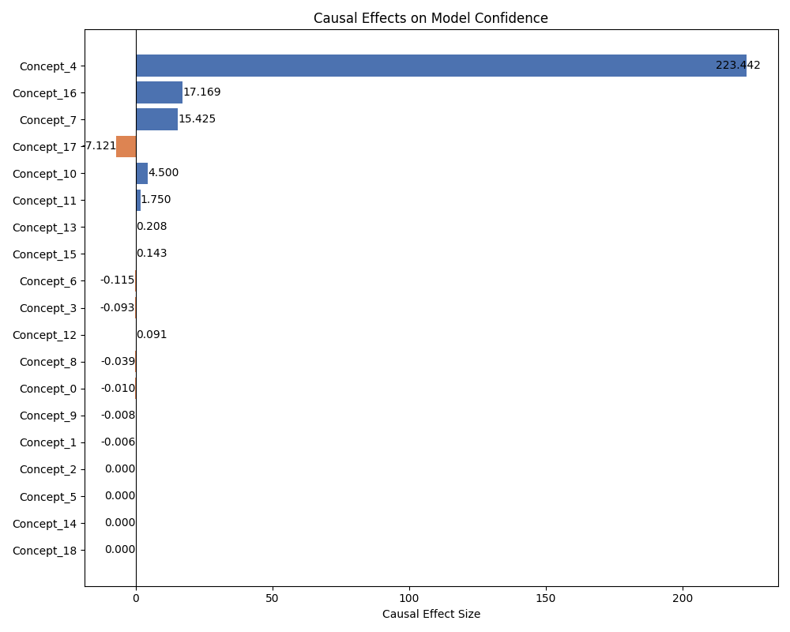
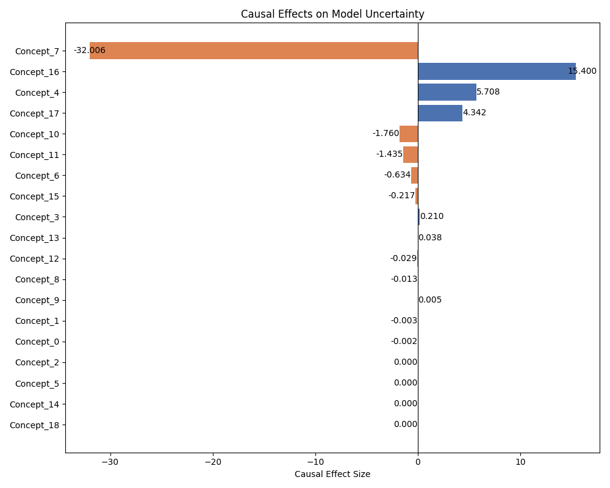

# Causal Concept Explanation Example

This document provides a walkthrough of the `concept_explainer.py` script, which demonstrates the usage of the `ConceptCausalExplainer` class from the `applybn` library. The script showcases an end-to-end pipeline for extracting concepts from data, training a predictive model, and estimating the causal effects of these concepts on model outcomes like confidence and uncertainty.

## Overview

The script performs the following key steps:

1.  **Load and Preprocess Data**: It loads the UCI Adult dataset, performs cleaning, one-hot encoding for categorical features, and scaling for numerical features.
2.  **Instantiate Explainer**: It creates an instance of `ConceptCausalExplainer`.
3.  **Extract Concepts**: It uses the explainer to discover concepts from the dataset.
4.  **Generate Concept Space**: It transforms the original feature space into a concept-based space.
5.  **Train Predictive Model**: A Random Forest classifier is trained on the original features.
6.  **Calculate Confidence and Uncertainty**: Model confidence and uncertainty are computed.
7.  **Estimate Causal Effects**: The causal impact of the discovered concepts on model confidence and uncertainty is estimated.
8.  **Visualize Results**: Tornado plots are generated to visualize these causal effects.
9.  **Extract Concept Meanings**: The script identifies the original features that are most representative of each discovered concept.

## 1. Setup and Imports

First, we import the necessary libraries. `pandas` is used for data manipulation, `sklearn` for machine learning tasks (model training, preprocessing, and data splitting), and `ConceptCausalExplainer` is the core class from our library.

```python
import pandas as pd
from rich import print as rprint # For pretty printing
from sklearn.ensemble import RandomForestClassifier
from sklearn.model_selection import train_test_split
from sklearn.preprocessing import OneHotEncoder, StandardScaler

# The main class for causal concept explanation
from applybn.explainable.causal_analysis import ConceptCausalExplainer
```

## 2. Loading and Preprocessing Data

The `load_and_preprocess_data` function handles fetching the UCI Adult dataset, which is a common benchmark dataset for classification tasks.

```python
def load_and_preprocess_data():
    """Load and preprocess the UCI Adult dataset.

    Returns:
        tuple: (X_processed, y, X_original) where:
            X_processed (pd.DataFrame): Processed features, ready for modeling.
            y (pd.Series): Binary labels (income >50K or <=50K).
            X_original (pd.DataFrame): Original features before encoding/scaling.
    """
    # URL for the UCI Adult dataset
    url = "https://archive.ics.uci.edu/ml/machine-learning-databases/adult/adult.data"
    # Define column names as per the dataset description
    column_names = [
        "age", "workclass", "fnlwgt", "education", "education-num",
        "marital-status", "occupation", "relationship", "race", "sex",
        "capital-gain", "capital-loss", "hours-per-week", "native-country", "income",
    ]
    # Read the data, treating ' ?' as NaN values
    data = pd.read_csv(url, names=column_names, header=None, na_values=" ?")

    # Remove rows with any missing values
    data.dropna(inplace=True)
    # Reset the DataFrame index after dropping rows
    data.reset_index(drop=True, inplace=True)

    # Separate features (X) and the target variable (y)
    # X_original stores the features before any transformation, useful for interpreting concepts later
    X_original = data.drop("income", axis=1).reset_index(drop=True)
    # Convert the income column to binary labels (1 if >50K, 0 otherwise)
    y = (
        data["income"]
        .apply(lambda x: 1 if x.strip() == ">50K" else 0)
        .reset_index(drop=True)
    )

    # Identify categorical columns for one-hot encoding
    categorical_cols = X_original.select_dtypes(include=["object"]).columns
    # Initialize OneHotEncoder:
    # - sparse_output=False means it returns a dense array
    # - handle_unknown='ignore' means if an unknown category is encountered during transform, it's ignored
    encoder = OneHotEncoder(sparse_output=False, handle_unknown="ignore")
    # Apply one-hot encoding
    X_encoded = pd.DataFrame(
        encoder.fit_transform(X_original[categorical_cols]),
        columns=encoder.get_feature_names_out(categorical_cols),
    )
    
    # Separate numeric columns
    X_numeric = X_original.select_dtypes(exclude=["object"]).reset_index(drop=True)
    # Concatenate numeric features with the new one-hot encoded features
    X_processed = pd.concat(
        [X_numeric.reset_index(drop=True), X_encoded.reset_index(drop=True)], axis=1
    )

    # Identify numeric columns for scaling
    numeric_cols_to_scale = X_numeric.columns # Note: These are from the original X_numeric, not X_original
    # Initialize StandardScaler to standardize features by removing the mean and scaling to unit variance
    scaler = StandardScaler()
    # Apply scaling to the numeric columns in the processed feature set
    X_processed[numeric_cols_to_scale] = scaler.fit_transform(X_processed[numeric_cols_to_scale])
    # Reset index of the fully processed dataset
    X_processed.reset_index(drop=True, inplace=True)

    return X_processed, y, X_original
```

## 3. Main Execution Block

The `main` function orchestrates the entire explanation process.

```python
def main():
    """Demonstration of using CausalModelExplainer on a sample dataset."""
    # Step 1: Load and preprocess the data
    X, y, original_X = load_and_preprocess_data()

    # Step 2: Create discovery (D) and natural (N) datasets
    # The dataset is split into a 'discovery' set (D) used for concept extraction
    # and a 'natural' set (N) which can be used for other purposes (e.g., validation, though not explicitly here).
    # shuffle=False is used to maintain the original order if necessary, though random_state ensures reproducibility.
    D, N = train_test_split(X, test_size=0.3, random_state=42, shuffle=False)
    # Reset indices for D and N to ensure they are clean and start from 0.
    # drop=False keeps the old index as a new column, which might be useful for tracking.
    D.reset_index(drop=False, inplace=True)
    N.reset_index(drop=False, inplace=True)

    # Step 3: Instantiate the explainer
    # This creates an object of our ConceptCausalExplainer class.
    explainer = ConceptCausalExplainer()

    # Step 4: Extract concepts
    # The extract_concepts method analyzes the discovery dataset (D) and the natural dataset (N)
    # to identify meaningful clusters of data points, which are then treated as concepts.
    cluster_concepts = explainer.extract_concepts(D, N)
    rprint(f"Discovered concepts (cluster assignments): {cluster_concepts}")

    # Step 5: Generate concept space
    # The generate_concept_space method transforms the original feature space (X)
    # into a new space (A) where each dimension may represent a discovered concept.
    # This typically involves assigning each data point in X to one or more concepts.
    A = explainer.generate_concept_space(X, cluster_concepts)
    rprint(f"Concept space A:\n{A.head()}")

    # Step 6: Train a predictive model
    # For demonstration, a RandomForestClassifier is trained on the original processed features (X) and labels (y).
    # This model's predictions will be analyzed for confidence and uncertainty.
    predictive_model = RandomForestClassifier(n_estimators=100, random_state=42)
    predictive_model.fit(X, y)

    # Step 7: Calculate confidence and uncertainty
    # The calculate_confidence_uncertainty method uses the trained model
    # to determine its confidence and uncertainty for each prediction on the dataset X.
    confidence, uncertainty = explainer.calculate_confidence_uncertainty(
        X, y, predictive_model
    )
    rprint(f"Calculated confidence (first 5): {confidence[:5]}")
    rprint(f"Calculated uncertainty (first 5): {uncertainty[:5]}")

    # Step 8: Prepare data for causal effect estimation
    # Create copies of the concept space data (A) and append the calculated confidence and uncertainty as new columns.
    # These will serve as the outcome variables for causal effect estimation.
    D_c_confidence = A.copy()
    D_c_confidence["confidence"] = confidence # Add confidence as a column

    D_c_uncertainty = A.copy()
    D_c_uncertainty["uncertainty"] = uncertainty # Add uncertainty as a column

    # Step 9: Estimate causal effects
    # The estimate_causal_effects_on_continuous_outcomes method is called twice:
    # once for confidence and once for uncertainty. It estimates how changes in the
    # presence or activation of concepts affect these continuous outcomes.
    effects_confidence = explainer.estimate_causal_effects_on_continuous_outcomes(
        D_c_confidence, outcome_name="confidence"
    )
    rprint(f"Causal effects on confidence:\n{effects_confidence}")

    effects_uncertainty = explainer.estimate_causal_effects_on_continuous_outcomes(
        D_c_uncertainty, outcome_name="uncertainty"
    )
    rprint(f"Causal effects on uncertainty:\n{effects_uncertainty}")

    # Step 10: Generate visualizations
    # Tornado plots are used to visualize the estimated causal effects.
    # These plots show the relative importance and direction of each concept's effect on the outcome.
    explainer.plot_tornado(
        effects_confidence, title="Causal Effects on Model Confidence", figsize=(10, 8)
    )

    explainer.plot_tornado(
        effects_uncertainty,
        title="Causal Effects on Model Uncertainty",
        figsize=(10, 8),
    )

    # Step 11: Extract and log concept meanings
    # The extract_concept_meanings method helps interpret what each discovered concept represents
    # by identifying the most important original features (from original_X) within each concept cluster from dataset D.
    selected_features_per_concept = explainer.extract_concept_meanings(
        D, cluster_concepts, original_X
    )
    # The results are printed to the console.
    rprint(f"\nConcept feature details: {selected_features_per_concept}")

# Standard Python idiom to run the main function when the script is executed.
if __name__ == "__main__":
    main()
```

 


## Conclusion

This example script demonstrates a comprehensive workflow for applying causal concept-based explanations. By following these steps, users can gain insights into how abstract concepts derived from their data influence the behavior and outcomes of their machine learning models. The visualization of causal effects and the interpretation of concept meanings provide actionable understanding beyond standard feature importance.

Remember to replace the placeholder image paths with the actual paths to your generated plots.
